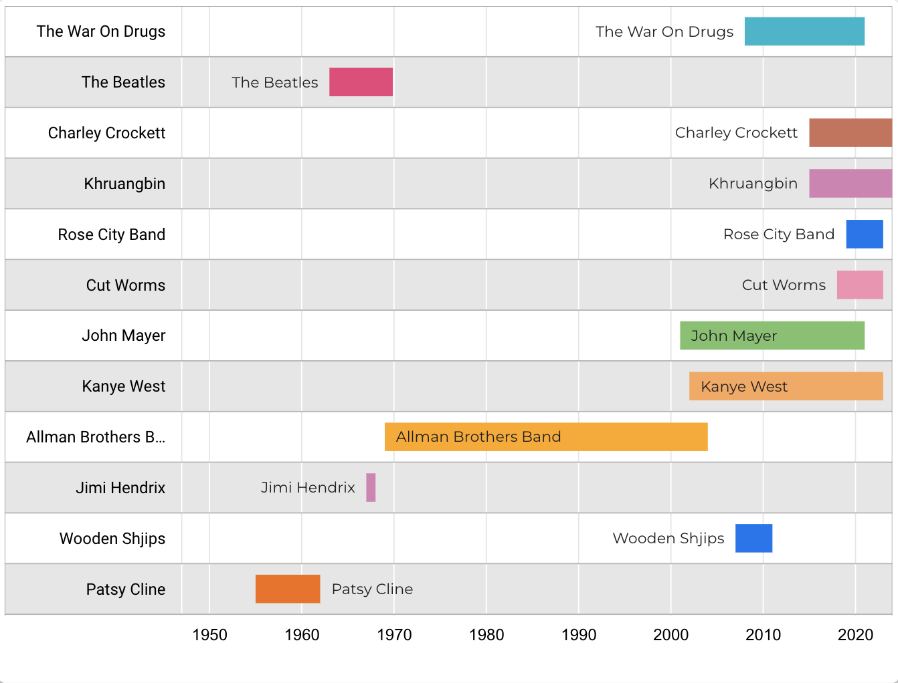

# Spotify favourite artists timeline: data visualisation

## Project overview

This project creates a data visualisation that shows user’s favourite artists on a timeline, user to view the years/musical eras they listen to most. User's top 100 artists are extracted from Spotify API and mapped to MusicBrainz studio album data to determine active years.

Looker Studio link: [view top artists timeline](https://lookerstudio.google.com/reporting/6d57ae49-1e7e-4f4d-8bdb-652eba24086b)



## Key features

- Extracts user’s top Spotify artists via the Spotify API.
- Maps Spotify Artist IDs to MusicBrainz Artist IDs (MBID) to extract studio albums and enable definition of artists' active years.
- Outputs a Gantt chart data visualisation of artists' active years using Looker Studio.

## Motivation

- User need: music enthusiast wants to explore the eras of music they listen to the most.
- Solution: A data-driven timeline visualisation showing artists' active years, as defined by their studio album releases.

## Tools and skills used

- Tools: Spotify API, MusicBrainz API, VS Code, Looker Studio, Perplexity Pro, ChatGPT, Google Sheets, Google BigQuery (later removed from solution)
- Skills: Python, data visualisation, leveraging GenAI tools, data cleansing, SQL, (later removed)

## Challenges and Solutions

| Problem | Solution |
| ------- | -------- |
| Spotify API does not distinguish between studio albums and other types, therefore The Beatles' active years would appear as 1963-2024, rather than 1963-1970. | MusicBrainz dataset distinguishes studio albums from compilations, re-releases and live records. Available via download or API |
| Linking Spotify artist IDs to MusicBrainz artist IDs (MBID). | MusicBrainz dataset contains plethora of external URLs including artist’s website, social media channels and “free streaming” parameter. Spotify URL contains artist’s Spotify ID after /artist/, therefore this can be extracted and used to associate Spotify ID with MusicBrainz dataset: https://open.spotify.com/artist/0k17h0D3J5VfsdmQ1iZtE9 |
| Handling large datasets (MusicBrainz database ~400MB) on a free BigQuery account. | Managed dataset with targeted MusicBrainz API calls to avoid large-scale file processing locally. |
| Limited Python experience. | Leveraged AI tools (e.g., ChatGPT, Perplexity Pro) to write and debug scripts. |

## Project Files

| File Name                          | Description                                                                 |
|-------------------------------------|-----------------------------------------------------------------------------|
| `get_top_artists.py`                | Extracts user's top Spotify artists and outputs `top_100_artists.csv`.       |
| `.env`                              | Holds Spotify API credentials. Ensure this is excluded from version control. |
| `top_100_artists.csv`               | Contains user’s top Spotify artists. Sample file included.                  |
| `input_spotify_ID_output_MBID.py`   | Maps Spotify Artist IDs to MusicBrainz IDs, generating `artists_mbid.csv`.  |
| `artists_mbid.csv`                  | Spotify artist IDs connected to MusicBrainz IDs.                            |
| `in_multiple_mbid_out_releases.py`  | Calls MusicBrainz API for studio albums released in UK/US per artist. Outputs `all_artists_albums.csv`. |
| `convert_to_gantt_data.py`          | Converts `all_artists_albums` to artist start year and end year. Outputs `gantt_chart_data_format.csv`. |

## Setup Instructions

### Prerequisites

- Spotify Developer Account, authorization and access token [Spotify API Documentation](https://developer.spotify.com/documentation/web-api/)
- Python 3.x installed with dependencies from `requirements.txt`.

### Steps

1. Clone this repository:

   ```bash
   git clone https://github.com/your-repo-name
   cd your-repo-name
   ```

2. Create a `.env` file for Spotify API credentials:
    
    ```bash
    SPOTIFY_CLIENT_ID=your_client_id
    SPOTIFY_CLIENT_SECRET=your_client_secret
    SPOTIFY_REFRESH_TOKEN=your_refresh_token
    ```

3. Install dependencies:

    ```bash
    pip install -r requirements.txt
    ```


4. Run the scripts in the following order:

- **Extract top Spotify artists:**

  ```
  python get_top_artists.py
  ```

- **Map Spotify IDs to MusicBrainz IDs:**

  ```
  python input_spotify_ID_output_MBID.py
  ```

- **Get studio album releases per MBID**
  ```
  in_multiple_mbid_out_releases.py
  ```

- **Convert releases to artist active years**
  ```
  convert_to_gantt_data.py
  ```

5. Import the data (`artists_mbid.csv`) into Looker Studio for visualisation.
Use LookerStudio to create Gantt chart data visualisation: Upload convert_to_gantt_data.csv, then Insert > Timeline 
- Date range dimension: start_year
- Row label: artist_name
- Bar label: artist_name
- Start time: start_year
- End time: end_year
- Sort: artist_index ASC

## Future Enhancements

- Include single releases for artists who predate the album era.
- Automate the data visualisation pipeline.
- Create a web app for easier user interaction.

## Contributions

This project is open for collaboration! Submit issues or pull requests to contribute. Refer to `CONTRIBUTING.md` for details.

## License

This project is licensed under the MIT License. See `LICENSE` for details.
